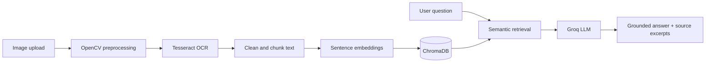

# Framewise

**Ask what your images know.** Framewise turns text inside an image into a searchable, question-answering workspace. Upload a scan, screenshot, or photographed page; inspect the extracted text; then ask questions and get answers grounded in the source.

## Project abstract

Framewise is an image-based retrieval-augmented generation (RAG) system for asking natural-language questions about text found in images. OpenCV prepares each image for recognition, and Tesseract OCR extracts its text. The text is cleaned and split into overlapping chunks, which are converted into semantic embeddings and stored in ChromaDB. When a user asks a question, the system retrieves the most relevant chunks and supplies them to a Groq-hosted large language model. The model responds using the retrieved content, while the interface displays the source excerpts so answers remain transparent and traceable.

## How it works



## Run locally

1. Install Python 3.10 or later and [Tesseract OCR](https://github.com/UB-Mannheim/tesseract/wiki). On Windows, add Tesseract to `PATH`, or set `TESSERACT_CMD` in your `.env` file.
2. Create and activate a virtual environment, then install dependencies:

   ```powershell
   py -m venv .venv
   .\.venv\Scripts\Activate.ps1
   pip install -r requirements.txt
   ```

3. Copy `.env.example` to `.env` and set `GROQ_API_KEY` using a key from [Groq Console](https://console.groq.com/keys). Without the key, image OCR and indexing still work, but answers are disabled.
4. Start the Streamlit app:

   ```powershell
   streamlit run streamlit_app.py
   ```

5. Open [http://localhost:8501](http://localhost:8501).

The FastAPI endpoints remain available separately when needed:

```powershell
uvicorn main:app --reload
```

The sentence-transformer embedding model downloads on first use. ChromaDB stores its local index in `chroma_db/`.

## Stack

Python · Streamlit · FastAPI · OpenCV · Tesseract OCR · LangChain · Sentence Transformers · ChromaDB · Groq